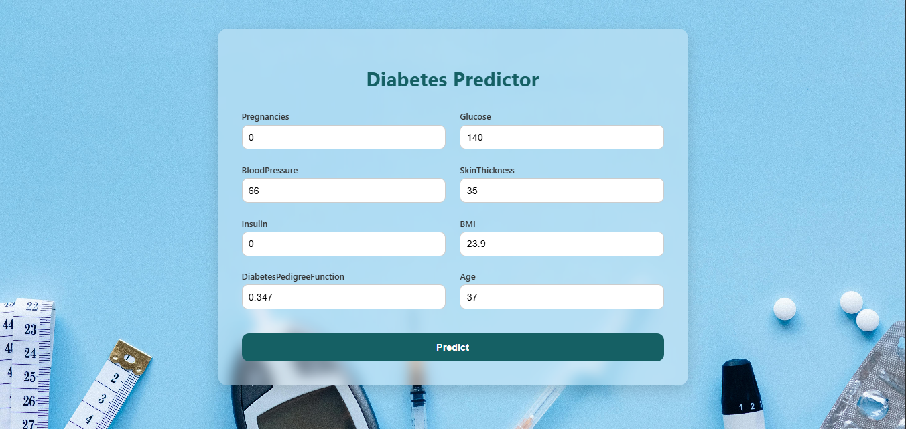

# 🩺 Diabetes Predictor — My Journey from Model Training to Real-World Usage

A full-stack machine learning web application that predicts the likelihood of diabetes based on patient input. Built using **React** for the frontend and **FastAPI** for the backend. The core prediction is powered by a **K-Nearest Neighbors (KNN)** model trained on real-world medical data.

---

## 📸 Demo Screenshot




---

## 🧠 Why I Built This Project

This project is my second hands-on full-stack ML project — right after I completed the Pizza Price Predictor using linear regression. That one taught me how to train a regression model, but I wanted to go a level deeper with classification. I recently learned about **K-Nearest Neighbors (KNN)** and decided to use it for something more meaningful — **predicting diabetes**.

The initial model was built and trained on **Google Colab**, where I explored the dataset, visualized it using Matplotlib and Seaborn, and got solid results using KNN. But here’s the thing — I believe in **implementation over just research**. What’s the point of a model if it's stuck inside a notebook and no one else can use it?

That’s when I got curious:  
**What if I could actually let users use the model through a proper web interface?**

So I used **FastAPI** to build a backend and load the trained `.pkl` model, and then built a responsive, animated frontend with **React** to collect input and show predictions. It was one of the most fun and rewarding projects I’ve done.

This wasn’t just another assignment — it was my way of turning **data science into a real, interactive experience**.

---

## 📦 Tech Stack

* **Frontend**: React, Vite, Vanilla CSS
* **Backend**: FastAPI, Python, scikit-learn
* **Model**: K-Nearest Neighbors (KNN)
* **Styling**: Custom medical UI with blur + animations

---

## 🧠 What I Learned

✅ How to train and save a classification model in Python
✅ How to use FastAPI to serve a `.pkl` model via REST APIs
✅ How to build a clean frontend in React and connect it with Axios
✅ How to design a proper full-stack machine learning pipeline
✅ Most importantly: how to **turn research into something usable**

---

## ❤️ Personal Note

This app is the result of a mindset shift — from just **learning models in notebooks** to building **real-world applications**. I wanted to challenge myself to go beyond just accuracy scores and visualize plots. I wanted to see: **Can I turn this into something people can use?**

And I did.

This project taught me how **backend and frontend** can work together with machine learning in between. It gave me a practical perspective of deploying models and designing real experiences. It’s a part of my journey — and I’m proud of every step I took building this.

---

## ⚙️ 1. Installation & Setup

### 🔙 Backend Setup (FastAPI + Python)

```bash
cd backend
python -m venv venv
venv\Scripts\activate        # On Windows
# OR
source venv/bin/activate     # On Mac/Linux

pip install -r requirements.txt
uvicorn app:app --reload
````

🔗 Backend runs at: [http://localhost:8000](http://localhost:8000)
🧪 Test API: [http://localhost:8000/docs](http://localhost:8000/docs)

---

### 🎨 Frontend Setup (React + Vite)

```bash
cd ../frontend
npm install
npm run dev
```

🖥️ Frontend runs at: [http://localhost:5173](http://localhost:5173)

---

## 🌍 Connect With Me

Made with 💙 by [@shahriarsworld](https://github.com/shahriarsworld)


